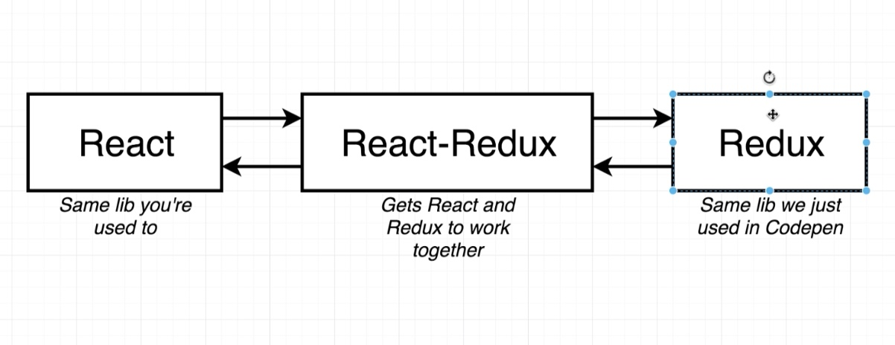
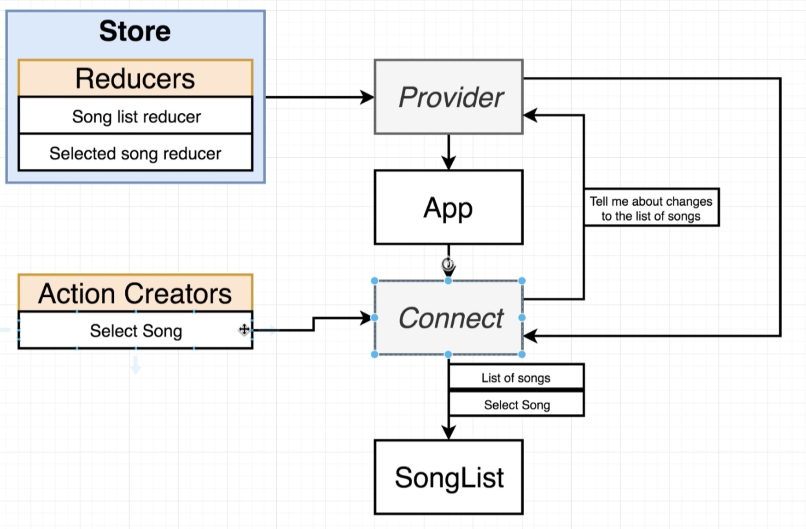
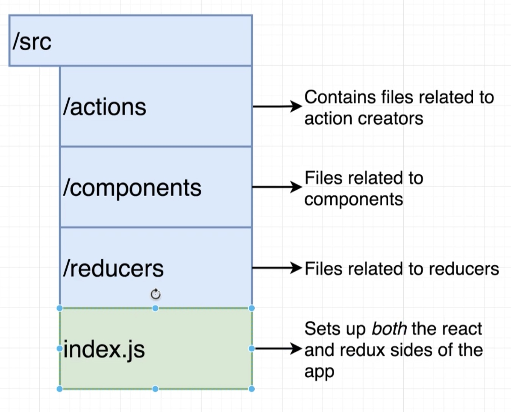

Set up
------

<https://create-react-app.dev/docs/getting-started/>

1. **Create React**:`npx create-react-app repo-name` or `npm init react-app repo-name` or `yarn create react-app repo-name`
2. **Install redux and React-Redux **`npm i redux, and react-redux`

### Difference: React, Redux, React-Redux



React is a lib, Redux is lib. **React-Redux** is a 3rd library that bridges React and Redux. – Redux is not designed to work only with React. You need React-Redux to use React and Redux together. \*you need to `npm i redux, and react-redux`

### How React-Redux works



1. **Store **contains all the reduces and states.
2. Take **Store** as *props* into **Provider** - **Provider** and **Connect** are components created by Redux.
3. **Connect** communicates with **Provider**, not through *props* but through *Context* system instead!
4. **Connect** works with both **Reducers** to get what different pieces of state we want to get, and what differennt **Action Creators** we want to wire.
5. **Connect** will eventually both from **Reducers** and **Action Creators** inside a component as *props*.

**Store**

The Redux application state lives in the **store**, which is initialized with a reducer. When used with React, a **\<Provider\>** exists to wrap the whole application, and anything within the Provider can have access to Redux.

```js
import { createStore } from 'redux'
import { Provider } from 'react-redux'
import reducer from './reducers'

const store = createStore(reducer)

render(
  <Provider store={store}>
    <App /> //App is wrapped inside Provider
  </Provider>,
  document.getElementById('root')
)
```

**Connect**

* The **connect()** function is one typical way to connect React to Redux. A connected component is sometimes referred to as a **container**.
* **connect() **automatically connects action with dispatch – you don’t have to write store.dispatch(selectSong(song))
* Everything is passed as **props** through **connect!**

### Redux Project Structure



```js
//Action Creator
export const selectSong = song => {
    // Return an action
    return {
        type: 'SONG_SELECTED',
        payload: song
    };
}
 
// export default selectSong;


/**
 **/
 import { selectSong } from '../actions';
//Use { } when importing named export, no {} when importing export default 
```

You wiill very likey to export multiple action creators, so use **named export** instead of **export default**

```js
//Reducers
import { combineReducers } from "redux";

const songsReducer = () => {
    return [
        { title: 'No Scrubs', duration: '4:05'},
        { title: 'Macarena', duration: '2:05'},
        { title: 'All Star', duration: '3:15'},
        { title: 'I want it', duration: '1:14'}
    ];
};

const selectedSongReducer = (selectedSong = null, action) => {
    if(action.type === 'SONG_SELECTED') {
        return action.payload;
    }

    return selectedSong;
};

export default combineReducers({
    songs: songsReducer,
    selectedSong: selectedSongReducer
    //key is going to be the key that shows up inside the state object.
});
//You can export reducers like this^ - this is equivalent to..

const combineReducers({
    songs: songsReducer,
    selectedSong: selectedSongReducer
    )};
export default combineReducers    
```

```js
//index.js/src

import React from 'react';
import ReactDOM from 'react-dom';
import { Provider } from 'react-redux'; //Provider should be imported from react-redux, not redux(not using Context!)
import { createStore } from 'redux'; //Store is a single object that combines Reducers and Action Creators
import App from './components/App';
import reducers from './reducers'

ReactDOM.render(
    <Provider store={createStore(reducers)}> {/* Pass a store prop and wire reducers to the Provider - now you have the global store.*/}
        <App />
    </Provider>, document.querySelector('#root')
    );
```

```js
//SongList.js 
//component and connect!

import React, { Component } from 'react';
import { connect } from 'react-redux';
//you need to use connect directly in the component you need to use connect

class SongList extends Component{
    render() {
        return <div>SongList</div>;
    }
}

export default connect()(SongList);

//connect(): invoke connect function, () invokes the second function:SongList inside connect

//For example,
function connect() {
  return function () {
    return 'Hi there!';
  }
}
connect() //output: nothing, but connect is invoked
connect()()//output: 'Hi there'
  }
}
```

### 

### Configuring Connect with MapStateProps

(Important step!! you will do this process in any redux app!)

```js
import React, { Component } from 'react';
import { connect } from 'react-redux'; 
import { selectedSong } from '../actions'

class SongList extends Component{
    render() {
        console.log(this.props);
        return <div>SongList</div>;
    }
}

const mapStateToProps = (state) => {
    return { songs: state.songs} 
}

export default connect(mapStateToProps, { selectSong })(SongList);
```

Breakdown..

```js
const mapStateToProps = (state) => {
    return { songs: state.songs} // results in -> this.props={ songs: state.songs }
}
//this function is named mapStateToProps by convention:Take a state object and map it and convert it to props
//The first argument:state has all the combined reducers. The first argument to a mapStateToProps function is the entire Redux store state (the same value returned by a call to store.getState()). Because of this, the first argument is traditionally just called state
```

```js
export default connect(mapStateToProps, { selectSong })(SongList);

// This function should be passed as the first argument to connect, and will be called every time when the Redux store state changes. If you do not wish to subscribe to the store, pass `null` or `undefined` or an empty `()` to connect in place of mapStateToProps.
// Passing action creator as a second argument, Connet will pass it into the component as props.
// You can either write {selectSong} or {selectSong: selectSong}
// Connect does contain this syntax automatically `store.dispatch(actionCreator)`
```

```js
class SongList extends Component{
    render() {
        console.log(this.props);
        //Will print the list of props coming from Store, converted from state to props.
        return <div>SongList</div>;
    }
}


```

### REMEMBER:

This step will be repeated always in your react-redux projects.

1. Always import { connect } at the top. import { connect } from 'react-redux';
2. Alwasy call connect with the first argument, and pass the designated React component as the second function. export default connect(mapStateToProps)(SongList);
3. Always define **mapStateToProps** which is always going to take the first argument:state, second argument:action creators -\> it’s always going to return an object -\> this object is always going to show up as props inside the React component.

```js
class SongList extends Component{

 render() {

 console.log(this.props); // output: mapStateToProps, selectSong(Action)

 return \<div\>SongList\</div\>;

 }

}

const mapStateToProps = (state) => {

 return { songs: state.songs} 

}

export default connect(mapStateToProps, { 

 selectSong

})(SongList);

```